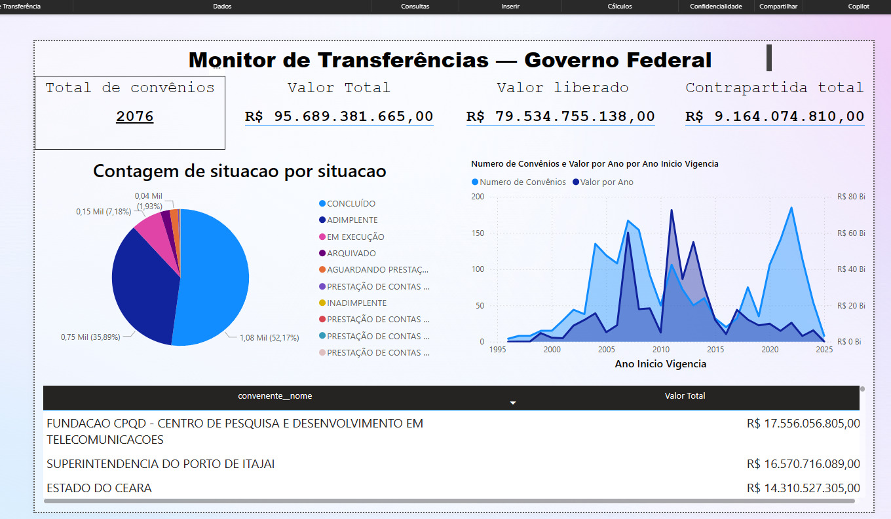
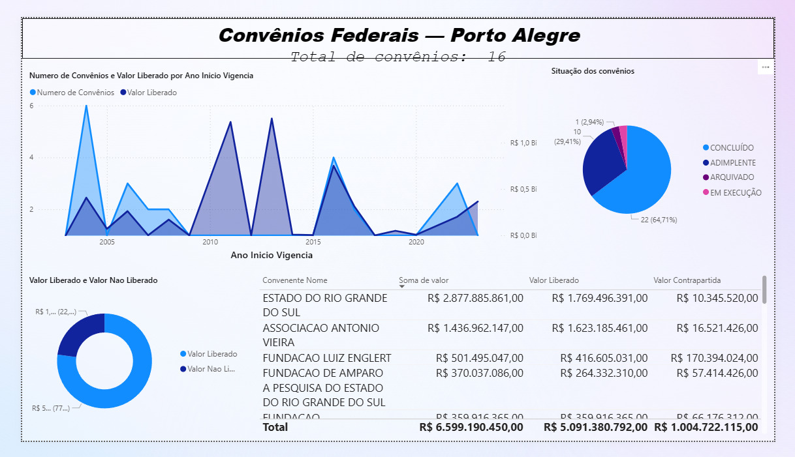

# Monitor de Transferências do Governo Federal


Projeto academico de Business Intelligence com foco em transparencia publica, construido a partir de dados abertos do Portal da Transparencia do Governo Federal.

## Aviso Academico

> Este repositorio foi desenvolvido exclusivamente como trabalho academico.
> O conteudo tem finalidade educacional e de demonstracao tecnica em ETL, modelagem de dados e analise no Power BI.

## Privacidade

- Nomes dos integrantes foram anonimizados neste repositorio.
- Informacoes pessoais e identificadores sensiveis foram removidos do material publico.
- Conteudo com identificacao direta (ex.: link nominal de apresentacao) foi ocultado.

## Equipe

- Integrante 1 (anonimizado)
- Integrante 2 (anonimizado)
- Integrante 3 (anonimizado)
- Integrante 4 (anonimizado)

## Objetivo

Mapear a destinacao, a eficiencia de liberacao financeira e a situacao legal dos convenios federais, com analises comparativas e visuais interativos no Power BI.

Pergunta central do estudo:

> O recurso empenhado pela Uniao esta sendo efetivamente liberado e convertido em beneficio para a populacao?

## Visao Geral

Mesmo com alto volume de dados publicos disponiveis, a interpretacao pratica dessas bases ainda exige tratamento tecnico. Para resolver isso, o projeto utiliza:

- Pipeline ETL automatizado via API.
- Estrutura de dados orientada a analise.
- Dashboards em Power BI para leitura executiva e auditoria.

Base legal e institucional:

- Lei de Acesso a Informacao (Lei no 12.527/2011)
- Portal da Transparencia (dados abertos governamentais)

## Arquitetura de Dados

### 1. Extracao automatizada via API

A coleta foi realizada com Python no endpoint de convenios:

- Endpoint: /api-de-dados/convenios
- Periodo analisado: 01/01/2025 a 31/12/2025
- Regra tecnica da API: maximo de 1 dia por requisicao
- Estrategia: iteracao diaria com paginacao automatica

Recursos implementados no ETL:

- Retry automatico por dia (ate 3 tentativas)
- Tratamento de codigos HTTP (200, 204, 400, 401/403, 429)
- Flatten recursivo do JSON com separador "\_\_"
- Exportacao em CSV com separador ";" e codificacao UTF-8-BOM

### 2. Estrutura da tabela fato

Arquivo gerado:

- Fato_Convenios_Lajeado_2025.csv

Granularidade:

- Cada linha representa um convenio individual

Categorias de variaveis:

- Identificacao: id, dimConvenio\_\_numero, numeroProcesso
- Temporalidade: dataInicioVigencia, dataFinalVigencia, dataConclusao
- Geografia: municipioConvenente**codigoIBGE, municipioConvenente**nomeIBGE, municipioConvenente**uf**sigla
- Convenente: convenente**nome, convenente**tipo
- Financeiras: valor, valorLiberado, valorContrapartida
- Governanca: situacao

## Tratamento e Modelagem no Power BI

### Power Query

- Tipagem de colunas financeiras para moeda/decimal fixo
- Ajuste regional para Portugues (Brasil)
- Padronizacao textual da coluna situacao (trim e maiusculas)
- Criacao da coluna temporal Ano Inicio Vigencia

### Medidas DAX

```dax
Total Convenios =
COUNTROWS('Fato_Convenios_Lajeado_2025')

Valor Total =
SUM('Fato_Convenios_Lajeado_2025'[valor])

Valor Liberado =
SUM('Fato_Convenios_Lajeado_2025'[valorLiberado])

Contrapartida Total =
SUM('Fato_Convenios_Lajeado_2025'[valorContrapartida])

Valor por Ano =
SUM('Fato_Convenios_Lajeado_2025'[valor])
```

## Dashboards

### Dashboard 1 - Visao Geral Nacional

- KPIs de volume total e execucao financeira
- Pizza para status dos convenios
- Linha para evolucao historica
- Barras com maiores recebedores (Top N)
- Evidencia visual: ver Figura 1

### Dashboard 2 - Eficiencia Local (Capital A)

- Rosca para comparacao entre valor pactuado e valor liberado
- Indicadores de maturidade e regularidade dos projetos
- Evidencia visual: ver Figura 2

### Dashboard 3 - Paradoxo da Liberacao (Capital B)

- Foco em megaprojetos e lentidao de liberacao
- Contraste entre regularidade legal e liquidez real

### Dashboard 4 - Indicadores Gerais

- KPIs de capilaridade territorial e institucional
- Area de evolucao de liberacao ao longo do tempo
- Matriz por ministerio e conformidade
- Dispersao entre valor e prazo de execucao

## Figuras dos Dashboards

Figura 1 - Painel geral de transferencias federais.



Fonte: elaboracao da equipe (trabalho academico).

Figura 2 - Painel de eficiencia local (Porto Alegre).



Fonte: elaboracao da equipe (trabalho academico).

## Conclusoes

- Estar adimplente nao garante liberacao rapida de recursos.
- Existem diferencas relevantes de execucao entre realidades locais.
- Dashboards facilitam a identificacao de gargalos de governanca e execucao.

## Estrutura do Repositorio

- Projeto.pbix
- Fato_Convenios_Lajeado_2025.csv
- Texto.text

## Como Executar o ETL

1. Instale as dependencias Python:

```bash
pip install requests pandas
```

2. Configure sua chave de API no script:

- CHAVE_API = "SUA_CHAVE_AQUI"

3. Execute o script Python de extracao.
4. Importe o CSV no Power BI e aplique as medidas DAX.

## Referencias

- Portal da Transparencia do Governo Federal
- Lei no 12.527/2011 (Lei de Acesso a Informacao)

---

Projeto academico com foco em transparencia publica, governanca de dados e analise de politicas publicas por meio de Business Intelligence.
